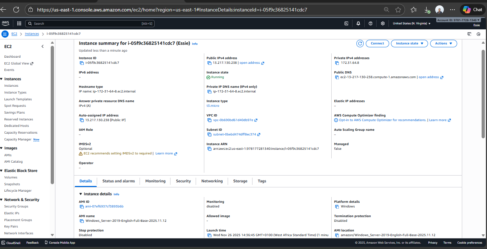
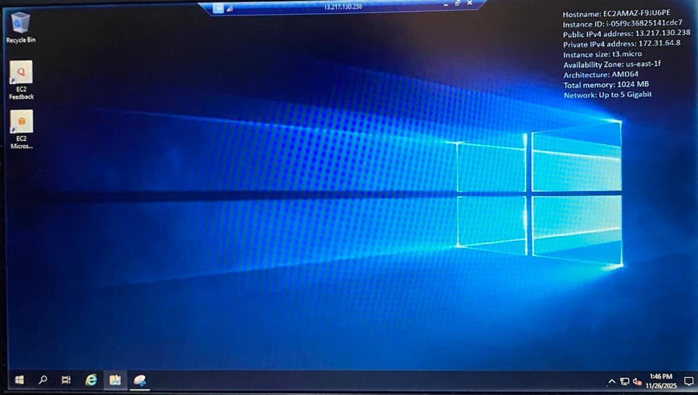
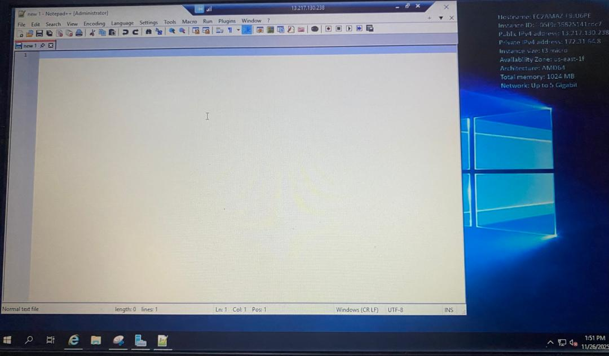

# Week 1: AWS EC2 Windows Lab

This project demonstrates hands-on lab with **AWS EC2**.  
I practiced launching a Windows EC2 instance, connecting via **RDP**, installing software, and managing the instance lifecycle.  

## Screenshots

### 1. EC2 Instance Details

### 2. RDP Login Window

### 3. Windows Desktop

### 4. Notepad++ Installed

### 5. Instance Stopped/Terminated

## Detailed Steps
For full step-by-step instructions, see [Notes/steps.md](notes/steps.md)

## Tools Used
- **AWS EC2** (Windows Server 2019)  
- **Remote Desktop Protocol (RDP)**  
- **Notepad++**  
